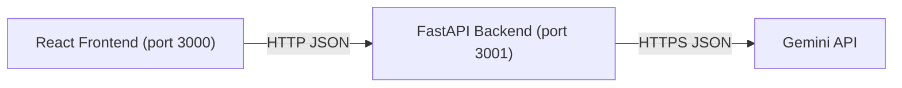

# AI Copilot Backend (FastAPI)

## Overview

This FastAPI service powers the AI Copilot chat application. It exposes REST endpoints to:
- Manage chat sessions
- Store and retrieve message history (in memory, for development)
- Call the Gemini API to generate assistant replies

The service is designed for local development with CORS enabled for a React frontend on port 3000 and runs on port 3001 by default.

### Architecture



## Environment variables

Place these in ai_copilot_backend/.env or export them before starting the app:

- GEMINI_API_KEY (required): API key for Google Gemini.
- GEMINI_MODEL (optional): Defaults to "gemini-1.5-flash".
- ALLOWED_ORIGINS (optional): Comma‑separated list of explicit origins allowed by CORS. Defaults to "http://localhost:3000".
- ALLOWED_ORIGINS_REGEX (optional): Regex pattern to allow dynamic origins, used in addition to ALLOWED_ORIGINS. Useful for hosted environments with dynamic or workspace URLs. Keep allow_credentials implications in mind (see CORS section).
- PORT (optional): Intended server port (informational). Start uvicorn with the same port.

Example .env:
```
GEMINI_API_KEY=your_key_here
GEMINI_MODEL=gemini-1.5-flash
ALLOWED_ORIGINS=http://localhost:3000,http://127.0.0.1:3000,https://localhost:3000,https://127.0.0.1:3000
# Example regex pattern (adjust to your environment, uncomment to use):
# ALLOWED_ORIGINS_REGEX=^https://your-frontend-domain\.example\.com(:\d+)?$
PORT=3001
```

You can also copy ai_copilot_backend/.env.example and fill in your values.

## Setup and run (port 3001)

1) Install and configure
- cd ai-copilot-chat-application-4349/ai_copilot_backend
- (Optional) python -m venv .venv && source .venv/bin/activate  # Windows: .venv\Scripts\activate
- pip install -r requirements.txt
- Create .env as shown above

2) Start the server
- uvicorn src.api.main:app --reload --host 0.0.0.0 --port 3001

3) Verify
- GET http://localhost:3001/ returns {"status":"ok"}
- Open http://localhost:3001/docs for interactive API docs
- Open http://localhost:3001/openapi.json for the schema

## Frontend configuration (React)

- Set REACT_APP_API_BASE_URL to your backend base URL. For local dev:
  - REACT_APP_API_BASE_URL=http://localhost:3001
- If your frontend runs over HTTPS, your backend must also be accessed via HTTPS (or be on the same domain with TLS termination) to avoid mixed content blocking.
- After changing React .env values, you must rebuild/restart the frontend for changes to take effect.

## API endpoints

- GET /: Health check
- GET /api/sessions: List sessions (SessionListResponse with "sessions": [SessionModel])
- POST /api/sessions: Create a new session (SessionCreateResponse with "session": SessionModel)
- GET /api/sessions/{session_id}/history: Return the message history (HistoryResponse with "session_id" and "history": [MessageModel])
- POST /api/chat: Send a message and receive an assistant reply (ChatResponse with "session_id", "reply", "message_id", "timestamp")

See interfaces/openapi.json or the /docs UI for field details.

## CORS configuration

CORS is configured via Starlette’s CORSMiddleware and reads ALLOWED_ORIGINS and ALLOWED_ORIGINS_REGEX from the environment.

- allow_credentials=True
- allow_methods=["*"]
- allow_headers=["*"]

Important notes:
- With allow_credentials=True, browsers do not allow "*" for allow_origins. Always list exact origins in ALLOWED_ORIGINS or use ALLOWED_ORIGINS_REGEX to match the specific domain pattern of your frontend (e.g., dynamic workspace domains).
- ALLOWED_ORIGINS should be a comma‑separated list of full origins (scheme + host + optional port), no trailing slashes.
- ALLOWED_ORIGINS_REGEX is applied in addition to ALLOWED_ORIGINS and is helpful when the frontend domain can vary. Use carefully and as narrowly scoped as possible.

## Troubleshooting

### CORS or “Network error” from the browser
- Confirm the frontend base URL:
  - In the React app, REACT_APP_API_BASE_URL must point to the backend (e.g., http://localhost:3001).
  - After changing .env values, rebuild/restart the React app.
- Ensure the frontend’s origin exactly matches an entry in ALLOWED_ORIGINS (including scheme and port) or matches ALLOWED_ORIGINS_REGEX.
- Restart the backend after changing ALLOWED_ORIGINS or ALLOWED_ORIGINS_REGEX.
- Avoid https frontend + http backend; browsers block mixed content. Use matching schemes or a reverse proxy/ingress that terminates TLS consistently.
- Verify the backend responds (outside the browser, not subject to CORS) using curl:
  - curl -i http://localhost:3001/
  - curl -i http://localhost:3001/api/sessions
  - curl -i -X POST http://localhost:3001/api/sessions
- In the browser Network tab, the backend responses should include Access-Control-Allow-Origin matching the frontend origin, and Access-Control-Allow-Credentials: true when credentials are used.

### Missing or invalid GEMINI_API_KEY
- Missing key: The /api/chat endpoint returns HTTP 500 with detail "GEMINI_API_KEY is not configured on the server."
- Invalid/unauthorized key or other upstream issues: The service returns HTTP 502 with detail "Gemini API error: …" propagated from the provider response.
- Confirm GEMINI_MODEL is valid for your key. Default is gemini-1.5-flash.

### Port or connectivity issues
- If port 3001 is taken, choose another (e.g., 3101) and start uvicorn with that port and host 0.0.0.0. Update the frontend’s REACT_APP_API_BASE_URL accordingly.
- Verify the health endpoint (/) and /docs are reachable from the frontend environment.

## Replacing the in‑memory store with a database

The app uses InMemorySessionStore in src/api/store.py. To persist data, implement a replacement with the same public interface:

- has_session(session_id: str) -> bool
- create_session(title: Optional[str]) -> Dict[str, Any] 
- list_sessions() -> List[Dict[str, Any]]
- append_message(session_id: str, role: str, content: str) -> Dict[str, Any]
- get_history(session_id: str) -> List[Dict[str, Any]]

Then in src/api/main.py, replace:
- store = InMemorySessionStore()
with your DB-backed store. Ensure you maintain API response shapes defined in src/api/models.py so the frontend remains compatible.

## OpenAPI generation

There are two recommended ways to refresh the API schema in interfaces/openapi.json:

1) From the running app:
- Start the backend and download http://localhost:3001/openapi.json to interfaces/openapi.json.

2) Using the built-in script:
- cd ai-copilot-chat-application-4349/ai_copilot_backend
- python -m src.api.generate_openapi
- The file is written to interfaces/openapi.json

This schema is used for documentation and can be the basis for future client generation.
